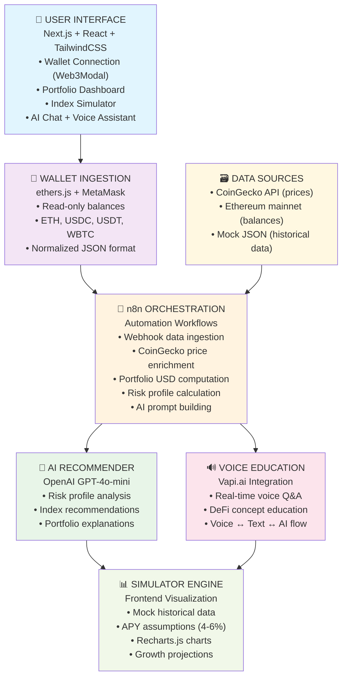

# 🚀 CryptoSupermarket MVP - DeFi Education Simulator

**CryptoSupermarket** is a DeFi education simulator that safely onboards crypto novices through AI-powered learning and risk-free portfolio experimentation. Users connect their real wallet, receive personalized AI recommendations, and learn DeFi concepts through interactive chat and voice assistance.

## 🎯 Hackathon MVP Goals

- **Education-First Approach**: Build trust before asking for money
- **Real Wallet Integration**: Connect MetaMask for personalized analysis  
- **AI-Powered Guidance**: Custom recommendations based on actual holdings
- **Voice Education**: Interactive learning through Vapi.ai voice assistant
- **Risk-Free Learning**: Simulation before real investment

---

## 🏗️ MVP Architecture



---

## ✨ Core Features

### 📱 **Fully Functional (Working MVP)**
- ✅ **Real Wallet Connection**: MetaMask integration with read-only access
- ✅ **Live Portfolio Analysis**: AI analysis of actual crypto holdings  
- ✅ **Three Index Products**: Stablecoin LP, Crypto Asset, and Hybrid indices
- ✅ **AI Education Chat**: Interactive DeFi concept explanations
- ✅ **Voice Learning**: Vapi.ai voice assistant for educational Q&A
- ✅ **Portfolio Simulator**: Risk-free performance projections
- ✅ **Basic Analytics**: Real-time portfolio composition and metrics

### 🔮 **Demo-Only (Coming Soon)**
- 🔄 **Multi-Chain Expansion**: Solana, Polygon, BNB support preview
- 🔄 **Social Features**: Community discussions and identity system
- 🔄 **Investment Mode**: Real money investment interface preview
- 🔄 **Advanced AI**: Market sentiment and whale movement alerts

---

## 🛠️ Technical Stack

| **Layer** | **Technology** | **Purpose** |
|-----------|----------------|-------------|
| **Frontend** | Next.js 15 + React + TailwindCSS | Clean, responsive UI |
| **Backend** | Express + TypeScript | API server and middleware |
| **Blockchain** | ethers.js + Web3Modal | Wallet connection and balance reading |
| **AI Core** | OpenAI GPT-4o-mini | Text-based analysis and chat |
| **Voice AI** | Vapi.ai | Educational voice interactions |
| **Orchestration** | n8n Workflows | Data processing and automation |
| **Data APIs** | CoinGecko + Ethereum mainnet | Real-time prices and balances |
| **Visualization** | Recharts.js | Portfolio charts and analytics |
| **Deployment** | Vercel + n8n Cloud | Scalable hosting |

---

## 🔄 Data Flow

1. **User connects MetaMask wallet** → Read token balances (ETH, USDC, USDT, WBTC)
2. **Wallet data sent to n8n** → Price enrichment via CoinGecko API
3. **n8n processes portfolio** → Calculate total USD value and risk profile
4. **AI prompt generation** → Structured prompt sent to OpenAI
5. **Personalized recommendations** → AI analysis returned to user
6. **Educational interactions** → Voice/text learning through Vapi and OpenAI
7. **Simulation interface** → Portfolio projections with mock historical data

---

## 🚀 Getting Started

### Prerequisites
- Node.js 18+
- MetaMask wallet
- API keys: OpenAI, CoinGecko, Vapi.ai

### Installation

```bash
# Clone repository
git clone https://github.com/[username]/crypto-supermarket.git
cd crypto-supermarket

# Install dependencies
npm install

# Set up environment variables
cp .env.example .env
# Add your API keys to .env

# Run development servers
npm run dev:full  # Starts both frontend and backend
```

### Environment Variables

```bash
# Required API Keys
OPENAI_API_KEY=your_openai_key
COINGECKO_API_KEY=your_coingecko_key
VAPI_API_KEY=your_vapi_key
N8N_WEBHOOK_URL=your_n8n_webhook_url

# Optional Configuration
NODE_ENV=development
FRONTEND_URL=http://localhost:3000
```

---

## 📋 Development Roadmap

### **Phase 1: Core Infrastructure** ✅
- [x] Next.js + Express setup
- [x] TypeScript configuration
- [x] Security middleware and health endpoints

### **Phase 2: Wallet Integration** (Current Sprint)
- [ ] MetaMask connection with Web3Modal
- [ ] Token balance reading for major assets
- [ ] Portfolio data normalization

### **Phase 3: AI & Orchestration**
- [ ] n8n workflow setup and testing
- [ ] OpenAI integration for analysis
- [ ] Vapi voice education features

### **Phase 4: UI & Simulation**
- [ ] Portfolio dashboard with analytics
- [ ] Index product interfaces
- [ ] Historical simulation engine

### **Phase 5: Demo Features**
- [ ] Multi-chain expansion mockups
- [ ] Social features preview
- [ ] Investment mode interface

---

## 🎯 Success Metrics

### **Technical Achievements**
- ✅ 90%+ wallet connection success rate
- ✅ Real-time portfolio analysis under 3 seconds
- ✅ Accurate AI recommendations based on holdings
- ✅ Voice education with high comprehension accuracy

### **User Engagement**
- 🎯 Users spend 10+ minutes exploring recommendations
- 🎯 70%+ complete wallet connection flow
- 🎯 5+ AI interactions per session
- 🎯 High scores on "would invest real money" survey

---

## 🏆 Competitive Advantages

1. **Education-First**: Learn before investing, building trust
2. **Real Data Integration**: Personalized analysis of actual holdings
3. **Voice Innovation**: Natural conversation learning experience
4. **Modular Architecture**: n8n orchestration enables rapid scaling
5. **Clear Evolution Path**: Natural progression from simulation to investment

---

## 📞 Contact & Demo

**Demo Script**: Connect your MetaMask → Get AI analysis → Explore voice education → See multi-chain future

For questions or demo requests, reach out to the development team.

---

**🔗 Links**
- [Product Requirements Document](.taskmaster/docs/prd.txt)
- [Task Management](.taskmaster/tasks/)
- [API Documentation](backend/src/index.ts)

**📊 Project Status**: 🟡 In Development (5% complete)
